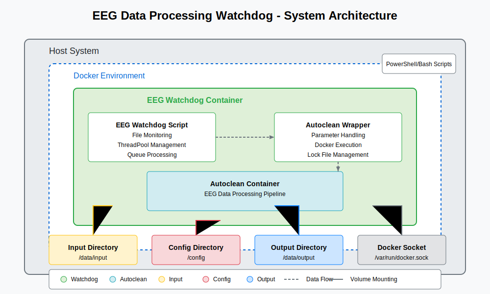

# EEG Data Processing Watchdog

A containerized solution for automatic monitoring and processing of EEG data files using the autoclean pipeline.

## System Overview

This system provides an automated way to process EEG data files with the following features:

- **Automatic Monitoring**: Watches directories for new EEG data files
- **Concurrent Processing**: Handles multiple files simultaneously with configurable limits
- **Docker Containerization**: Ensures consistent processing environment
- **Cross-Platform Support**: Works on Windows, Mac, and Linux
- **Command-Line Tools**: Provides easy-to-use scripts for manual processing



## Quick Start

### Prerequisites

- Docker and Docker Compose installed
- For Windows: PowerShell 5.1+
- For Linux/Mac: Bash shell

### Installation

1. Clone this repository:
```bash
git clone https://github.com/yourusername/eeg-watchdog.git
cd eeg-watchdog
```

2. Create the required directories:
```bash
mkdir -p input output config
```

3. Add your autoclean configuration:
```bash
cp /path/to/your/autoclean_config.yaml ./config/
```

4. Build the Docker image:
```bash
docker-compose build
```

### Starting the Watchdog

Start the automatic file monitoring system:

```bash
docker-compose up -d
```

View the logs:

```bash
docker-compose logs -f
```

### Processing Files

#### Automatic Processing

Simply place EEG data files in the `input` directory. The system will automatically detect and process them according to your configuration.

#### Manual Processing

**Windows:**

```powershell
# Import the autoclean function
. ./scripts/autoclean.ps1

# Process a file
autoclean -DataPath "C:\path\to\data.edf" -Task "RestingEyesOpen" -ConfigPath "C:\path\to\config.yaml"
```

**Linux/Mac:**

```bash
# Make the script executable
chmod +x ./scripts/autoclean.sh

# Process a file
./scripts/autoclean.sh -DataPath "/path/to/data.edf" -Task "RestingEyesOpen" -ConfigPath "/path/to/config.yaml"
```

## Configuration Options

### Maximum Concurrent Processes

Adjust the `--max-workers` parameter in `docker-compose.yml` to control how many files can be processed simultaneously:

```yaml
command: 
  # ... other parameters ...
  - "--max-workers"
  - "5"  # Process up to 5 files simultaneously
```

### File Extensions

Modify the `--extensions` parameter in `docker-compose.yml` to specify which file types to monitor:

```yaml
command:
  # ... other parameters ...
  - "--extensions"
  - "edf"
  - "set"
  - "vhdr"
  - "bdf"
  - "cnt"
```

### Processing Task

Change the `--task` parameter to specify a different processing task:

```yaml
command:
  # ... other parameters ...
  - "--task"
  - "ASSR"  # Change from default "RestingEyesOpen"
```

## Directory Structure

```
eeg-watchdog/
├── eeg_watchdog.py           # Main watchdog script
├── autoclean_wrapper.sh      # Wrapper for autoclean command
├── Dockerfile                # Container definition
├── docker-compose.yml        # Container orchestration
├── requirements.txt          # Python dependencies
├── scripts/
│   ├── autoclean.ps1         # Windows PowerShell script
│   └── autoclean.sh          # Linux/Mac Bash script
├── input/                    # Place EEG data files here
├── output/                   # Processed results appear here
├── config/                   # Configuration files
└── docs/
    └── images/
        └── system-architecture.svg
```

## Command-Line Parameters

### Watchdog Script

The `eeg_watchdog.py` script accepts the following parameters:

- `--dir`, `-d`: Directory to monitor for new EEG data files
- `--extensions`, `-e`: EEG data file extensions to monitor
- `--script`, `-s`: Path to the autoclean script
- `--task`, `-t`: EEG processing task type
- `--config`, `-c`: Path to configuration YAML file
- `--output`, `-o`: Output directory for processed files
- `--work_dir`, `-w`: Working directory for the autoclean pipeline
- `--max-workers`: Maximum number of concurrent processing tasks (default: 3)
- `--max-retries`: Maximum number of retries for error files (default: 3)
- `--reset-tracking`: Reset the tracking files and reprocess all files

#### File Tracking

The watchdog script maintains two CSV tracking files to manage processed files:

- `processed_files.csv`: Records successfully processed files with filename, timestamp, and filepath
- `error_files.csv`: Tracks files that encountered errors during processing, including retry counts

When a file is successfully processed, it's added to the success tracker and removed from the error tracker if present. Files that have already been successfully processed will be skipped when the watchdog restarts.

If a file encounters an error during processing, it will be retried up to the number of times specified by `--max-retries`. After reaching the maximum retry count, the file will be skipped in future runs unless the `--reset-tracking` flag is used.

### Command-Line Tools

Both the PowerShell and Bash scripts accept the same parameters:

- `-DataPath`: Directory containing raw EEG data or path to single data file
- `-Task`: Processing task type (RestingEyesOpen, ASSR, ChirpDefault, etc.)
- `-ConfigPath`: Path to configuration YAML file
- `-OutputPath`: (Optional) Output directory, defaults to "./output"
- `-Help`: Display help information

## Troubleshooting

### Logs

- **Container Logs**: `docker-compose logs -f`
- **Processing Logs**: Check the `output/[timestamp]_[filename]_[task]/process.log` files
- **Debug Mode**: Modify the logging level in `eeg_watchdog.py` to DEBUG for more details

### Common Issues

1. **Docker not running**:
   - Ensure Docker Desktop (Windows/Mac) or Docker daemon (Linux) is running

2. **Permission issues**:
   - Ensure the input, output, and config directories have appropriate permissions

3. **No files being processed**:
   - Check that the file extensions match the ones specified in `docker-compose.yml`

4. **Processing errors**:
   - Check the logs for the specific error message
   - Ensure your configuration file is correct
   - Verify that the EEG data files are valid

## License

[MIT License](LICENSE)

## Acknowledgments

This tool was created to work with the autoclean EEG processing pipeline.
